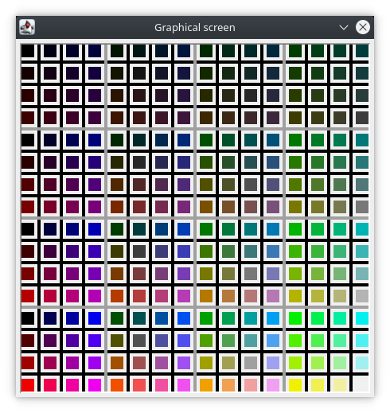
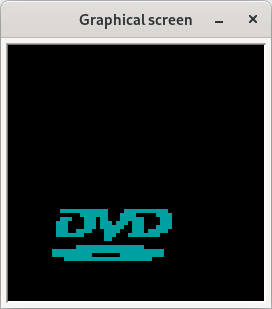

# SicDemos
This demo is part of SicDemos: a collection of assembly programs for the SIC/XE computer architecture. SicDemos is a companion project of [SicTools](https://github.com/jurem/SicTools) project (SIC/XE hypothetical computer simulator).

## Color table
A table of colors to help pick the colors to use in the graphical screen programs. Additional help for using the graphical screen can be found on the [Simulator documentation](http://jurem.github.io/SicTools/documentation/simulator).

* Source code: color-table.asm
* Graphical screen: 109x109 at A000
* Frequency: 100000 Hz = 100 kHz
* Author: Jakob Erzar, 2020

## Game of life
Animate [Conways' Game of Life](https://en.wikipedia.org/wiki/Conway's_Game_of_Life) on the graphical screen. The game is initialized with the glider figure at the top left corner.
* Source code: life.asm
* Graphical screen: 64x64 at A000
* Frequency: 10000000 Hz = 10 MHz
* Author: Jurij Mihelič

## H-tree fractal
Draw an H-tree fractal on the graphical screen.
* Source code: htree.asm
* Graphical screen 333x333 at A000
* Frequency: 10000 Hz = 10 kHz
* Author: Klemen Klanjšček, 2015

## The Chaos game Sierpinski triangle
The program draws the sierpinski triangle and is also capabile of drawing other fractals, that can be drawn by the chaos game, with a bit of tweeking.
The triangle is drawn iteratively, one point at a time, on a 200 by 200 window. This is implemented with two nested linear congruential generators.
* Source code: sier.asm
* Frequency: Depending uppon how fast you want the triangle to be rendered. 5000 Hz for medium speed and 10000 Hz for fast speed.
* Graphical screen: 200x200 at A000
* Author: Peter Mlakar, 2016

## Mandelbrot set visualization
Draw a visualization of the [Mandelbrot set](https://en.wikipedia.org/wiki/Mandelbrot_set) in the range between -2, 2, 2i and -2i.
For each pixel the color is computed as a number of iterations needed to escape the circle around 0 with the radius 2, mapped to a color range.
Almost all computation is done in floating point, save for loops and iteration count.
* Source code: mandel.asm
* Graphical screen 1000x1000 at A000
* Frequency: 10000000 Hz = 10 MHz
    * Drawing time can be vastly sped-up by resizing the screen or lowering the number of iterations, but appropriate variables must be adjusted (width, height, iter).
* Author: Blaž Rojc, 2018

## Rain drops
Simulates and visualizes rain on the graphical screen. Clock speed has to be at least 10000 = 10kHz but it needs to be increased with more drops and bigger screen. Drop count and screen size is adjustable. Change drops,count and randP to the desired drop count and scrow and sccol to the desired display dimensions (and then change the dimensions in the sictools simulator setting). At the start of the program random starting positions and seeds for the drops are set. After that an endless loop is executed where each drop is moved.
* Source code: rain.asm
* Graphical screen: 64x64 at A000
   * dimensions can be adjusted at will
* Frequency: 10000 Hz = 10 kHz
   * Must be adjusted if screen size od drop count is bigger
* Author: Martin Resman, 2019

## Bouncy
Animate moving bouncing balls on the graphical screen.
* Source code: bouncy.asm
* Graphical screen: 64x64 at A000
* Frequency: 10000 Hz = 10 kHz
* Author: Žiga Željko, 2020

## DVD screensaver
Animated DVD logo as a screensaver.

Any parameters such as dx, dy, screen size, ... can be found and adjusted at the bottom of the file.
* Source code: dvd-screensaver.asm
* Graphical screen: 64x64 at A000
    * Can be adjusted to any size (tested up to 300x300).
* Frequency: 10000000 Hz = 10 MHz
* Author: Maksimiljan Vojvoda, 2022

## Sort visualization
Visualizes running a selection sort on a table. To run open the graphical screen, set the frequency to at least 100kHz and start the program. The program will first generate a pseudo‐random table, then start the selection sort. Each comparison will highlight the element currently being compared in red. It will then add the smallest element found to the sorted portion of the table on the far left and color it green. While searching for the smallest element in the table, it will color the current smallest element found in cyan.
The table is generated by the `initbl` routine, which uses a modulo operator with large numbers to generate a randomized set. The table can be set manually by disabling the call to `initbl` and changing the `table` variable to the desired set of words (note that values of elements must be between 0 and 64 inclusive). The sort algorithm can also be replaced by modifying the `srttbl` procedure. The sorting algorithm can be arbitrary, but the subroutines `compr` and `swap` should be utilized for comparison and element swapping and the subroutines `hlelem` and `clrhl` for setting and clearing highlights of elements in the table (see routine definitions for how to pass parameters).
* Source code: sort.asm
* Graphical screen: 64x64 at A000
* Frequency: 100000 Hz = 100 kHz
    * Higher frequencies can be used to increase the speed. Note that higher frequencies may cause flickering of the column currently being compared.
* Author: Martin Prelog, 2022
