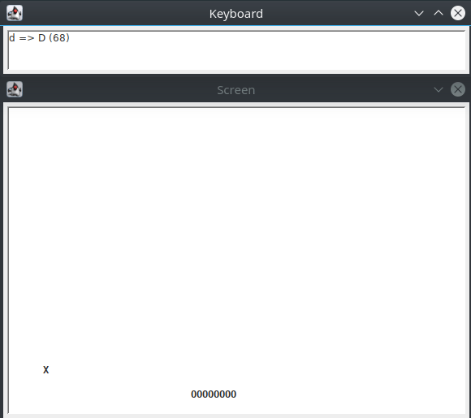

# SicDemos
This demo is part of SicDemos: a collection of assembly programs for the SIC/XE computer architecture. SicDemos is a companion project of [SicTools](https://github.com/jurem/SicTools) project (SIC/XE hypothetical computer simulator).

# Snake
The popular game, which you might have played on your Nokia phones or older consoles. The aim of the game is to eat food (X) and grow your snake without crashing into the walls!

## How to play
Open the following views:
- `View > Textual screen`
- `View > Keyboard`

Click on the keyboard input area, and press:
- A to move left
- D to move right

## Info
* Source code: snake.asm
* Frequency: 200000 Hz = 200 kHz
* Utilizes the keyboard and textual screen addon
* Author: Jakob Erzar, 2018