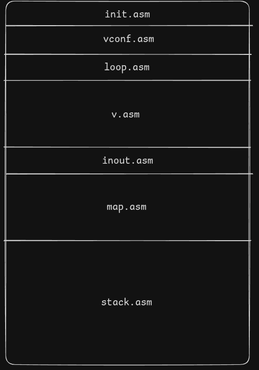

# v

We had ```vi```, then ```vim``` and now ```nvim```. But we are taking a step back and introducing **```v```**, a much worse ```vi```.

Text editor built in SIC/XE assembly that runs in the simulator https://github.com/jurem/SicTools.


## Usage

1. Install simulator from https://github.com/jurem/SicTools. Follow their installation instructions.
2. Put the SicTools ```sictools.jar``` in ```/scripts```.
3. Navigate to ```/scripts``` and build the project:

    ```
    cd scripts
    ./build.sh project
    ```
4. Run the simulator:
    ```
    ./run_simulator.sh
    ```

5. Open textual screen and keyboard:
    ```
    Addons > Toggle textual screen
    Addons > Toggle keyboard
    ```

6. Set frequency to at least 5 000 000:
    ```
    SicTools > Settings > General > Frequency > 5000000
    ```

7. Load program and run:
    ```
    Machine > Load obj > out.obj > Open
    Start
    ```

## Features

- Commands:
    - **movement**: `H`,`J`,`K`,`L`,`B`,`W`,`G`,`0`,`$`
    - **text manipulation**: `Y`,`D`,`P`
    - **insert mode**: `I`,`A`,`O`
    - **command mode**: `:W NN`, `:E NN`, `:Q`
        - `N` = number (0-9)
        - Files can be read/written **only once!** (this is because the simulator does not have file reseting)
- Bottom bar (with mode indicator)
- Startup screen
- User configuration

## Program structure

The program is assembled like this:



where:

- `init.asm` initializes interfaces and command mappings
- `vconf.asm` user configuration (custom mappings)
- `loop.asm` main input loop
- `v.asm` command implementations, vim specifics
- `inout.asm` screen and keyboard interface
- `map.asm` map interface (character -> function mapping)
- `stack.asm` stack interface

## User configuration

See exaples in `./config_examples/`!

You can use the APIs to add your own commands. You make your own function (that can use APIs) and then use the map API to map a character to your function. Your config file (`vconf.asm`) is run after `init.asm` so you can overwrite mappings. Put `vconf.asm` in root of project.

### APIs
For details see the source code.

- **V** API
    > **NOTE**: *Some functions mirror the **Inout** API but add editor specific constraints. For example `c_l` won't go cursor right if next character is null.*
    - `c_i` enter insert loop
    - `c_a` cursor right and enter insert loop
    - `c_o` shift lines down, go to new line and enter insert loop
    - `c_I` go to first character in line and enter insert loop
    - `c_A` go to last non-null character in line and enter insert loop
    - `c_h` cursor left
    - `c_l` cursor right
    - `c_k` cursor up
    - `c_j` cursor down
    - `c_g` cursor to first character in file
    - `c_G` cursor to last non-null character in file
    - `c_w` cursor to next word in line
    - `c_b` cursor to previous word in line
    - `c_0` cursor to first character in line
    - `c_dlr` cursor to last non-null character in line
    - `c_y` yank line into r_manip
    - `c_d` delete line and yank into r_manip
    - `c_p` paste line from r_manip
    - `cmd` enter command mode
- **Inout** API
    > **NOTE**: *Similar to the **V** API but without editor restrictions.*
    - `ioinit` clear screen and reset cursor
    - `cl` cursor left
    - `cr` cursor right
    - `cu` cursor up
    - `cd` cursor down
    - `crsrnl` cursor to start of new line (will not shift down lines)
    - `ctop` cursor to top left
    - `cbtm` cursor to bottom left
    - `cfirst` cursor to first character in line
    - `clast` cursor to last character in line (can be null)
    - `cprev` reset cursor to previous position
    - `rch` read character in cursor to A
    - `pch` print character to cursor in A
    - `map_ch` perform callback function in A on each cell
    - `map_ln` perform callback function in A on each cell in current line (that the cursor is on)
    - `input` WORD that holds address of keyboard
    - `shiftr` shift characters right in line from cursor (including cursor character)
    - `shiftl` shift character left in line from cursor (including the cursor character)
    - `shiftd` shift lines down (not including current line)
    - `drawnp` draw character (in T) to non operational cell in row (in A) and column (in B).
        > **NOTE**: *Operational lines are everything above the bottom bar. At and under that are non operational lines that functions dont touch (for example `shiftd` wont shift the bottom bar down). For specifics about argument checkout the function in `src/inout.asm`.*
    - characters (1 BYTE, 3 BYTE):
        - (`chnull`, `wnull`) 0x00
        - (`chesc`, `wesc`) 0x1B
        - (`chent`, `went`) 0x0A
        - (`chcrsr`, `wcrsr`) 0x5E
        - (`chspac`, `wspace`) 0x20
        - (`chback`, `wback`) 0x08
        - (`chshft`, `wshift`) 0xFF
- **Map** API
    - `mput` map character (in A) to function (in B)
    - `mget` get function (in `mfun`) for mapping of character (in A)
    - `mfun` WORD that holds the mapped function from `mget`
- **Stack** API
    - `spush` increment stack pointer
    - `spop` decrement stack pointer
    - `sp` WORD that holds address of stack pointer
    > **NOTE**: *for usage examples checkout `src/stack.asm`.*

## Out of scope features

- Commands (multi-char)
    - Dont have the screen be source of truth and have lines in some internal structure (trie)
    - Text manipulation
        - `<X><Y>` and `p` -> 1 register for `y`, `d`, `p`
            `<X>` can be { `y`, `d` }
            `<Y>` can be { nothing, `<X>`, movement }
        - *HARDER: `u`, CTRL-R -> undo-tree for `u` and CTRL-R (will need dynamic allocation)
    - Other
        - `r`
        - `s`
        - `c<Y>`
    - `<number><command>`
    - Visual mode
- Unlimited rows
- Expand simulator to have better keyboard (small letters, cursor ascii character, ...)
- Expand simulator to have file reseting, allowing writing / reading to one file without reseting the simulator.
